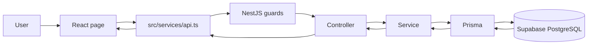
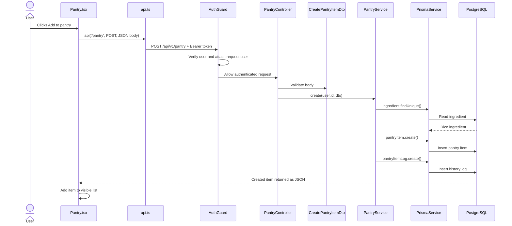
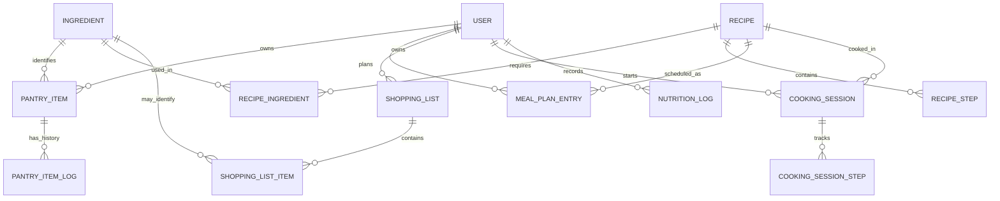
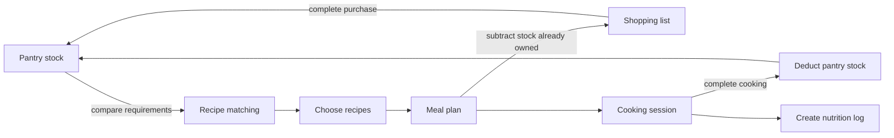

# Pantry-to-Plate Backend Guide

This guide explains the backend to teammates who are new to backend development. It uses the real project files and follows one request from the screen to the database.

## 1. The backend in one minute

The frontend is what the user sees and clicks. The backend is the part that:

- receives requests from the frontend;
- checks who the user is and whether the request is valid;
- applies Pantry-to-Plate business rules;
- reads or changes data in PostgreSQL;
- returns a response to the frontend.

In this project:



The short version is:

> Page asks, controller receives, service decides, Prisma stores, database remembers.

## 2. What “domain” and “mapping” mean

### Domain

A domain is one business area of the product, not a technical folder name.

Examples in Pantry-to-Plate:

- **Pantry** — food the user currently owns;
- **Recipes** — meals, ingredients, and cooking steps;
- **Meal Planner** — meals assigned to dates and meal slots;
- **Shopping List** — missing or manually added items to buy;
- **Cooking Mode** — a cooking session and the stock consumed;
- **Nutrition** — estimated nutrition records and summaries;
- **Users/Auth** — identity, profile, preferences, and access.

Most backend domains have their own folder under `backend/src/modules/`.

### Mapping

Mapping means connecting one representation of information to another.

This project has three important mappings:

1. **HTTP mapping** — a URL and HTTP method are mapped to a controller function.
2. **object mapping** — request JSON is mapped to a DTO and then to service input.
3. **database mapping** — Prisma models map TypeScript objects to PostgreSQL tables and relations.

Example:

```txt
POST /api/v1/pantry
        ↓ maps to
PantryController.create()
        ↓ receives
CreatePantryItemDto
        ↓ calls
PantryService.create()
        ↓ writes through
prisma.pantryItem.create()
        ↓ stored as
PantryItem row in PostgreSQL
```

## 3. The folder structure

```txt
pantry-inventory/
├── src/                           Frontend React application
│   ├── pages/                     Screens the user sees
│   ├── services/api.ts            Shared browser-to-backend request helper
│   ├── types/inventory.ts         Frontend view of backend response shapes
│   └── routing/                   Maps browser routes to pages
│
├── backend/
│   ├── src/main.ts                Starts and configures the API
│   ├── src/app.module.ts          Registers all backend domains
│   ├── src/common/                Shared guards, decorators, config, and utilities
│   ├── src/modules/               Business domains
│   ├── src/prisma/                Shared Prisma database connection
│   └── prisma/
│       ├── schema.prisma          Current database model and relationships
│       ├── migrations/            Ordered history of database structure changes
│       └── seed.ts                Starter/demo data
│
├── supabase/                      Local Supabase project configuration/templates
└── vercel.json                    Production routing: /api goes to the backend
```

## 4. The five files inside a typical domain

Use the Pantry domain as the pattern:

| File | Responsibility | Simple description |
|---|---|---|
| `pantry.module.ts` | Dependency wiring | Connects the domain's parts |
| `pantry.controller.ts` | HTTP routes | Receives requests and returns responses |
| `pantry.service.ts` | Business rules | Decides what should happen |
| `dto/pantry.dto.ts` | Input contract and validation | Defines what the client is allowed to send |
| `schema.prisma` | Persistent data model | Defines what is stored and how records relate |

The controller should stay thin. It should translate HTTP information and call the service. The service should contain the business decision. Prisma should be called from the service to read or write stored data.

## 5. One real request: adding rice to the pantry

Assume a signed-in user fills the “Add item” form and selects rice.



### Step-by-step file trace

1. `src/pages/dashboard/Pantry.tsx`
   - Collects values from the form.
   - Calls `api("/pantry", { method: "POST", body: ... })`.

2. `src/services/api.ts`
   - Adds `/api/v1` to the path.
   - Adds the user's bearer token.
   - Sends JSON to the backend.
   - Parses successful and error responses.

3. `backend/src/main.ts`
   - Applies the global `api/v1` prefix.
   - Enables CORS, security headers, logging, validation, and Swagger.

4. `backend/src/common/guards/auth.guard.ts`
   - Verifies the Supabase token in strict mode.
   - Attaches the authenticated user to the request.
   - Ensures the user exists in the application database.

5. `backend/src/modules/pantry/pantry.controller.ts`
   - Maps `POST /pantry` to `create()`.
   - Reads the user with `@CurrentUser()`.
   - Reads and validates the body with `CreatePantryItemDto`.
   - Calls `PantryService.create(user.id, dto)`.

6. `backend/src/modules/pantry/dto/pantry.dto.ts`
   - Requires a non-negative quantity.
   - Requires a unit.
   - Validates optional expiry, location, threshold, and notes.
   - Rejects fields that are not in the DTO because the global validation pipe uses a whitelist.

7. `backend/src/modules/pantry/pantry.service.ts`
   - Finds the selected ingredient or creates one from a supplied name.
   - Creates the user's pantry item.
   - Creates an `ADDED` history log.

8. `backend/src/prisma/prisma.service.ts`
   - Provides the shared database client used by services.

9. `backend/prisma/schema.prisma`
   - Maps `PantryItem` to the pantry record.
   - Relates it to one `User` and one `Ingredient`.
   - Maps `PantryItemLog` to its quantity history.

## 6. Core data relationships

This is the central product data model, simplified for teaching:



Important distinction:

- `Ingredient` is catalog knowledge: “rice exists and is normally measured in g/kg.”
- `PantryItem` is user-owned stock: “Ada currently has 2 kg of rice.”
- `RecipeIngredient` is a requirement: “Jollof rice needs 500 g of rice.”
- `ShoppingListItem` is an intention/purchase: “Buy 1 kg of rice.”

They may all mention rice, but they represent different business facts.

## 7. Domain-to-file map

All backend paths below start with `backend/src/modules/`.

| Domain | Controller/API entry | Business logic | Main stored models | Frontend areas |
|---|---|---|---|---|
| Auth | `auth/auth.controller.ts` | `auth/auth.service.ts` | `User`, Supabase identity | Login, Sign Up, Password Recovery |
| Users | `users/users.controller.ts` | `users/users.service.ts` | `User`, `UserProfile`, `UserPreference` | Onboarding, Settings |
| Ingredients | `ingredients/ingredients.controller.ts` | `ingredients/ingredients.service.ts` | `Ingredient`, alias, nutrition, conversion | Pantry ingredient picker |
| Pantry | `pantry/pantry.controller.ts` | `pantry/pantry.service.ts` | `PantryItem`, `PantryItemLog` | Pantry |
| Recipes | `recipes/recipes.controller.ts` | `recipes/recipes.service.ts` | `Recipe`, ingredients, steps, tags, reports | Explore, Recipe Details, My Recipes |
| Recipe Matcher | `recipe-matcher/recipe-matcher.controller.ts` | `recipe-matcher/recipe-matcher.service.ts` | Reads Pantry and Recipe models | Explore and recommendations |
| Meal Planner | `meal-planner/meal-planner.controller.ts` | `meal-planner/meal-planner.service.ts`, `ai-meal-planner.service.ts` | `MealPlanEntry` | Meals |
| Shopping List | `shopping-list/shopping-list.controller.ts` | `shopping-list/shopping-list.service.ts` | `ShoppingList`, `ShoppingListItem`, Pantry records | Grocery, Shopping List Generator |
| Cooking Mode | `cooking-mode/cooking-mode.controller.ts` | `cooking-mode/cooking-mode.service.ts` | `CookingSession`, steps, Pantry and Nutrition logs | Cooking Mode |
| Nutrition | `nutrition/nutrition.controller.ts` | `nutrition/nutrition.service.ts` | `NutritionLog`, recipe nutrition | Analytics and nutrition views |
| Dashboard | `dashboard/dashboard.controller.ts` | `dashboard/dashboard.service.ts` | Reads several domains | Dashboard |
| Recommendations | `recommendations/recommendations.controller.ts` | `recommendations/recommendations.service.ts` | Reads Recipes and Pantry | Dashboard/Explore suggestions |
| Favorites | `favorites/favorites.controller.ts` | `favorites/favorites.service.ts` | `RecipeFavorite` | Favorites |
| Food Analysis | `food-analysis/food-analysis.controller.ts` | `food-analysis/food-analysis.service.ts` | No photo storage; Gemini response | Food Scan |
| Measurement Profiles | `measurement-profiles/measurement-profiles.controller.ts` | `measurement-profiles/measurement-profiles.service.ts` | Profiles and overrides | Settings/conversions |
| Admin | `admin/admin.controller.ts` | `admin/admin.service.ts` | Catalog and moderation data | Admin-only operations |

## 8. The connected inventory loop

The main product story crosses several domains:



Two rules are especially important:

- Completing a shopping list adds bought ingredients to Pantry.
- Completing a cooking session deducts used ingredients from Pantry and refuses completion when stock is insufficient.

This is why Shopping List and Cooking Mode are not isolated features: both change the Pantry domain.

## 9. Cross-cutting files that affect every domain

| File/folder | Why it matters |
|---|---|
| `backend/src/app.module.ts` | A module is not active until it is registered here |
| `backend/src/main.ts` | Global URL prefix, validation, security, logging, CORS, docs |
| `backend/src/common/guards/` | Authentication, role checks, and rate limiting before controllers run |
| `backend/src/common/decorators/` | Reusable route helpers such as current user and open route |
| `backend/src/common/filters/` | Converts database availability failures into safer API responses |
| `backend/src/common/utils/` | Shared date, string, and unit conversion rules |
| `backend/src/prisma/` | Shared connection between services and PostgreSQL |
| `backend/prisma/schema.prisma` | Current source of truth for database structure |
| `backend/prisma/migrations/` | Deployable history of database structure changes |
| `src/services/api.ts` | Shared frontend API/auth/error behavior |
| `src/types/inventory.ts` | Frontend TypeScript contract for connected inventory responses |
| `vercel.json` | Sends production `/api/...` traffic to the backend service |

## 10. How to find the right file for a change

Ask these questions in order:

1. **What business domain owns the rule?**
   - Stock quantity belongs to Pantry.
   - What to buy belongs to Shopping List.
   - What a recipe requires belongs to Recipes.

2. **Is this input, behavior, or storage?**
   - Input shape/validation → DTO.
   - Business decision → service.
   - URL/HTTP method → controller.
   - Stored field/relation → Prisma schema plus a migration.
   - Screen behavior → frontend page/component.

3. **Does another domain consume the result?**
   - If yes, inspect both services and their module imports.

### Examples

| Requested change | Start here | Then check |
|---|---|---|
| Add a pantry item's supplier field | Pantry DTO/service + `schema.prisma` | migration, frontend Pantry type/form |
| Change low-stock logic | `pantry.service.ts` | Dashboard/recommendation consumers |
| Add a new Pantry endpoint | `pantry.controller.ts` | DTO and service method |
| Change how missing groceries are calculated | `shopping-list.service.ts` | unit conversion and measurement profiles |
| Change stock deduction after cooking | `cooking-mode.service.ts` | Pantry logs and nutrition log transaction |
| Add a new backend domain | new module/controller/service/DTO | register module in `app.module.ts` |

## 11. Rules for safe backend work

1. Never trust request data just because the frontend form looks correct; validate it in a DTO.
2. Always scope user-owned queries with `userId` so one user cannot read another user's data.
3. Put business rules in services, not React pages or controllers.
4. Use a database transaction when several writes must all succeed or all fail together.
5. Change `schema.prisma` and add a migration when persistent data changes.
6. Do not put `GEMINI_API_KEY`, database credentials, or service-role keys in frontend variables.
7. Keep frontend types aligned with backend responses.
8. Test the unhappy path: invalid input, missing record, wrong user, insufficient stock, and unavailable database.

## 12. A 45-minute teaching session

### Part 1 — Tell the product story (5 minutes)

Explain Pantry → Recipes → Meals → Grocery → Cooking → Pantry. Avoid framework terms at first.

### Part 2 — Draw the request pipeline (10 minutes)

Use:

```txt
Page → API helper → Guard → Controller → DTO → Service → Prisma → Database
```

Ask each teammate to explain one box in plain language.

### Part 3 — Trace one real request (15 minutes)

Open these files side by side:

1. `src/pages/dashboard/Pantry.tsx`
2. `src/services/api.ts`
3. `backend/src/modules/pantry/pantry.controller.ts`
4. `backend/src/modules/pantry/dto/pantry.dto.ts`
5. `backend/src/modules/pantry/pantry.service.ts`
6. `backend/prisma/schema.prisma`

Trace `POST /api/v1/pantry` from click to database and back.

### Part 4 — Small team exercise (10 minutes)

Give the team this task without coding it:

> “We want to record where each pantry item was purchased.”

They should identify:

- the new database field and migration;
- DTO validation;
- service create/update mapping;
- frontend type and form field;
- tests and authorization checks.

### Part 5 — Review (5 minutes)

Each person answers:

- Which file receives an HTTP request?
- Which file owns business rules?
- Which file defines stored relationships?
- Where is the authenticated user attached?
- Why can one feature need changes in two domains?

## 13. Useful local learning tools

With the backend running:

- Swagger: `http://localhost:4000/api/v1/docs`
- Health: `http://localhost:4000/api/v1/health`
- Database readiness: `http://localhost:4000/api/v1/health/ready`
- Prisma Studio: run `pnpm prisma:studio` inside `backend/`

Swagger helps the team see routes, request bodies, and responses. Prisma Studio helps them see records and relationships. Neither replaces reading the service that contains the business rule.

## 14. Beginner glossary

| Term | Plain meaning |
|---|---|
| API | The agreed way the frontend asks the backend for work |
| Endpoint | One HTTP method and URL, such as `POST /api/v1/pantry` |
| Controller | The API receptionist that receives a request |
| DTO | The allowed and validated shape of input data |
| Service | The place where business decisions are made |
| Module | The wiring that groups a domain's controller and services |
| Guard | A check that runs before the controller, such as authentication |
| ORM | A tool that lets code work with database records as objects |
| Prisma | The ORM used by this project |
| Model | A stored business object and its fields/relationships |
| Migration | A versioned change to database structure |
| Relation | A connection between stored models |
| Transaction | A group of database changes that succeeds or fails together |
| Authentication | Proving who a user is |
| Authorization | Deciding what that user is allowed to do |

## 15. The sentence the team should remember

> Start from the business domain, trace the request through the layers, and keep each rule in the layer that owns it.
